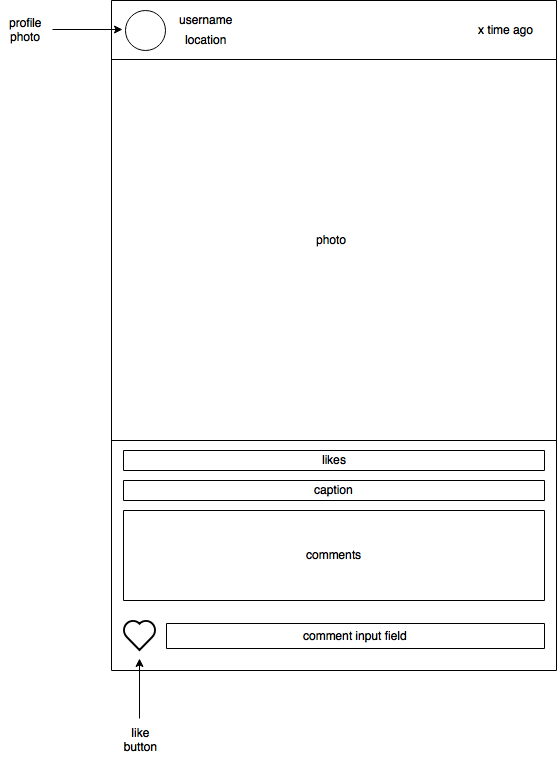

# Photogramme

Photogramme is a full-stack web application inspired by Instagram.


Live site: [http://photogramme.info]

Photogramme utilizes the following:

- Ruby on Rails
- React.js
- Redux
- PostgreSQL
- jQuery
- jBuilder
- BCrypt
- Cloudinary API
- Heroku
- react-router
- react-dropzone

# Features

The application is composed of three primary features:

### User Authentication

BCrypt is used to hash the passwords of users. As such, only the digest of a user's password is saved in Instagramme's database.

On the user-end, a cookie holding a BCrypt session token is utilized to maintain the user's current session. In the case of non-matching session tokens, the user will be redirected to the login page.

```ruby
class User < ApplicationRecord
  # Multi-level validations for user authentication
  validates :username, :password_digest, :session_token, :email, :name, presence: true
  validates :username, :session_token, :email, uniqueness: true
  validates :password, length: { minimum: 6, allow_nil: true }

  # ...

  # Passwords are stored in a hashed format for security
  def password=(password)
    @password = password
    self.password_digest = BCrypt::Password.create(password)
  end

  def is_password?(password)
    BCrypt::Password.new(self.password_digest).is_password?(password)
  end

  def self.find_by_credentials(username, password)
    user = User.find_by(username: username)
    return nil unless user && user.is_password?(password)
    user
  end

  # Session tokens are assigned and updated accordingly for users
  def generate_session_token
    SecureRandom::urlsafe_base64(16)
  end

  def reset_session_token
    self.session_token = generate_session_token
    self.save
    self.session_token
  end

  def ensure_session_token
    self.session_token ||= generate_session_token
  end
end
```

### Direct Photo Uploading

Users are able to upload photos directly into their Photogramme account.


Unlike server-side tools such as Paperclip, Photogramme uses a number of tools to facilitate file uploads:

- react-dropzone accepts an image via drag-and-drop (or manual selection)
- superagent transfers the uploaded image
- Cloudinary stores, manages, and modifies images

The PhotoForm presentational component (highlights below) retrieves the necessary information. Immediately after submission, the user is redirected back to his/her profile page in which the image can be viewed.

```javascript
class PhotoForm extends React.Component {
    // ...

  // helper methods to aid photo upload
  onImageDrop(files) {
    // ...
  }

  handleImageUpload(file) {
    // ...
  }

  handleSubmit(e) {
    e.preventDefault();
    const photo = this.state;
    delete photo["uploadedFile"];
    this.props.addPhoto(photo).then(hashHistory.push(`/${this.props.currentUser.id}`));
  }

  // In the upload form page, the Cloudinary URL (along with the location, caption, and the user's unique ID) of the uploaded photo is captured and submitted to the database
  render () {
    return (
      <div className="upload-section-main">
        <div className="upload-section">
          <Dropzone
            multiple={false}
            accept="image/*"
            className="dropzone"
            onDrop={this.onImageDrop.bind(this)}>
            <div className="dropzone-msg">
              {this.state.url === '' ? 'Drop and drop or select an image' :
              <div>
                
              </div>}
            </div>
          </Dropzone>
        </div>

        // ...
              <input
                type="hidden"
                className="upload-inputs"
                value={this.state.url}
                onChange={this.update('url')}/>
              <br />
              <input
                type='submit'
                value='Share'
                className="upload-submit" />
              <br />
        // ...
    );
  }
}
```

### Photo Feed

Upon login, users are able to see a feed of photos from (sorted by date). Users may Like and Comment on photos displayed in the feed.


In the case that the user has no followers, Photogramme currently displays photos from all users.

```ruby
class Api::PhotosController < ApplicationController
  #...

  def index
    if current_user
      if current_user.followers.length.zero?
        @user = current_user
        @photos = Photo.all
      else
        users_arr = [current_user]
        current_user.followings.each { |following| users_arr << following }
        @user = current_user
        @photos = Photo.where(user: users_arr).order(created_at: :desc)
      end
    end
  end

  # ...
end
```

### User Profile

Users have personalized profiles to display their details and photos.


Users can subscribe to other user's content by simply Following them.

# Design

### Wireframes

Early in production, detailed wireframes were produced





## Future Release
* [ ] Photo Details
* [ ] Profile Editing
* [ ] Tags
* [ ] Search
